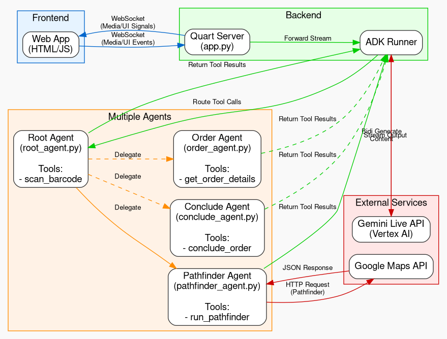

# Cymbal Operation Demo

This is a demonstration of an AI Pharmacy Fulfillment Assistant utilizing the **Gemini Live API on Vertex AI** for real-time multimodal interaction (audio/video) and the **Google ADK 2.0 Graph Agent** for backend tool orchestration.

## Architecture



- **Frontend**: A vanilla HTML/JS web interface that captures the user's webcam and microphone and streams it over WebSockets. The UI dynamically generates visual components, such as interactive medicine checklists and Google Maps route widgets, perfectly synchronized with exactly when the agent calls backend tools.
- **Backend**: A Flask/Quart server (`app.py`) that acts as a bidirectional bridge. It receives the WebRTC media stream over WebSockets and forwards it to the Gemini Live API on Vertex AI.
- **Agent Backends**: Google ADK 2.0 Agents (e.g. `agents/root_agent.py`, `agents/pathfinder_agent.py`) configured as robust tools for Gemini.
    - When Gemini detects a physical barcode on the camera stream, the system instantly triggers `scan_barcode`, silences the agent, and displays a red laser animation.
    - An interactive fulfillment checklist widget is presented, requiring user clicks.
    - Once confirmed, the Pathfinder agent calls Google Maps to calculate the delivery route and renders an inline map in the chat interface.

## Prerequisites
- Python 3.10+
- [`uv`](https://github.com/astral-sh/uv) (Recommended for dependency management)

## Installation

### Using requirements.txt

If you are using `requirements.txt` to install dependencies:

```bash
pip install -r requirements.txt
```
Or with `uv`:
```bash
uv pip install -r requirements.txt
```

### Installation from Scratch

1. **Set up the project folder:**
   ```bash
   mkdir Cymbal_operation
   cd Cymbal_operation
   ```

2. **Install the required dependencies using `uv`:**
   ```bash
   uv add quart google-genai pydantic python-dotenv google-adk googlemaps
   ```
   *Note: `google-adk` is the package for Google ADK 2.0.*


3. **Configure your Environment Variables:**
   Create a `.env` file in the root of `Cymbal_operation` and add your configuration variables:
   ```env
   GEMINI_API_KEY="AIzaSyYourApiKeyHere..."
   GOOGLE_MAPS_API_KEY="AIzaSyYourGoogleMapsApiKeyHere..."
   GCP_PROJECT_ID="your-gcp-project-id"
   GCP_LOCATION="us-central1"
   GEMINI_MODEL="gemini-2.5-flash-native-audio-latest"
   ```

## Running the Application

1. **Start the Quart Development Server:**
   Ensure you are in the `Cymbal_operation` directory, then run:
   ```bash
   uv run quart --app app run
   ```
   *Note: Set `--host=0.0.0.0` if you need to access it from another device on your local network.*

2. **Open the App:**
   Open your web browser and navigate to:
   `http://localhost:5000`
   *(Or the URL provided by your development environment)*

## Using the Demo

1. Click **"Connect & Start Live API"**.
2. Allow your browser to access your **Camera** and **Microphone**.
3. Cymbal, the AI pharmacy assistant, will introduce itself.
4. Hold a simulated order barcode ticket up to your webcam.
5. Cymbal will instantly scan the barcode, stop talking, and pull up an interactive medicine fulfillment checklist.
6. Click the buttons on the screen to confirm you've added the required items to the package.
7. Cymbal will calculate the delivery route using the Google Maps distance matrix, render a map on your screen, and ask for confirmation before concluding the order.
